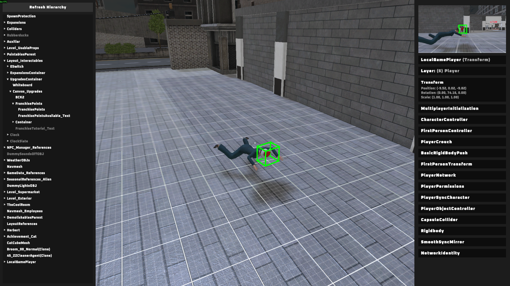
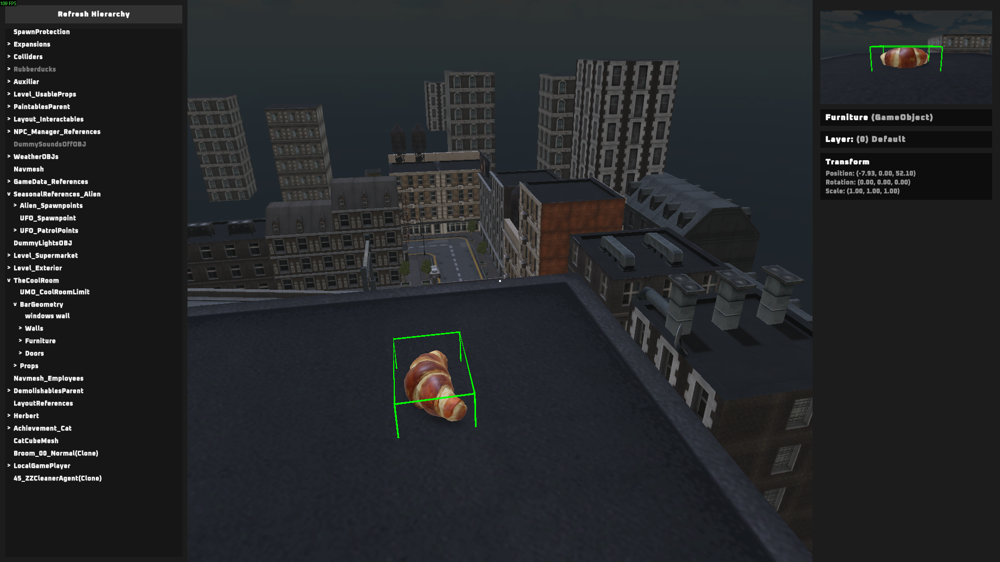

# Unity Analyzer  
Analyze and modify Unity Objects. Usefull for modding context.  

  

The goal is to recreate as many features of the unity editor, so you can analyze and edit game elements in real time.  

- Load into a level to start analyzing.  
- **Right-click** to change between the editor and ingame camera.  

  